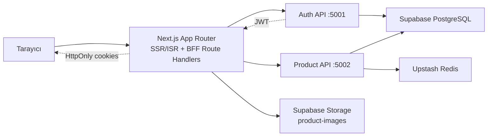
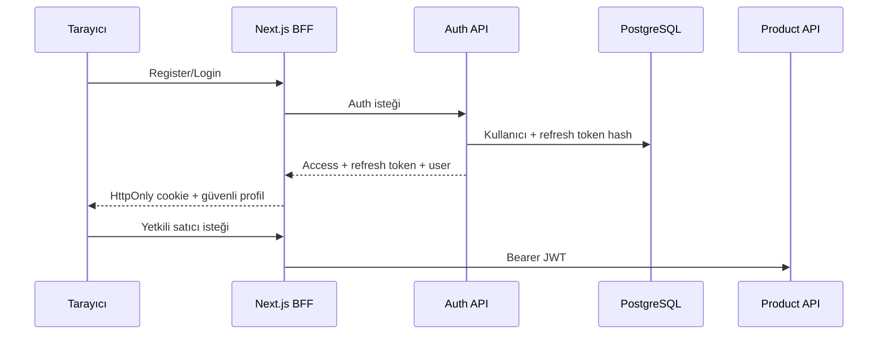
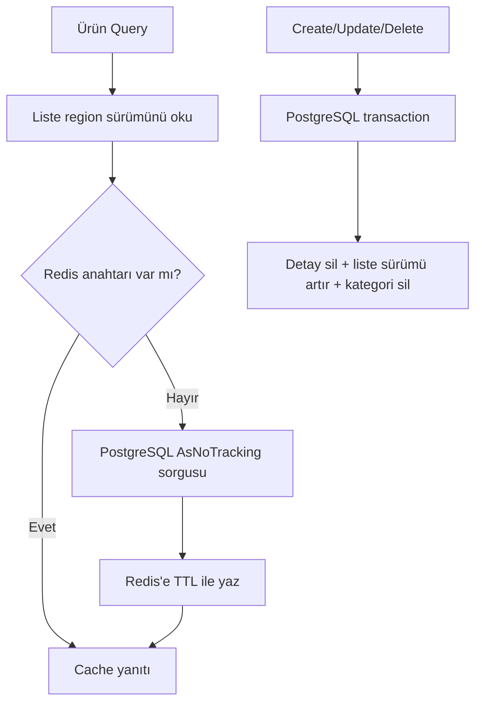

# LocalCart — Çok Dilli Yerel Pazaryeri

[](https://github.com/emrehasilik/task_2/actions/workflows/backend-ci.yml)
[](https://github.com/emrehasilik/task_2/actions/workflows/frontend-ci.yml)

LocalCart; yerel üreticilerin ürünlerini yönettiği, müşterilerin ise ürünleri arayıp filtreleyerek sepetine ekleyebildiği, Türkçe ve İngilizce çalışan bir pazaryeri uygulamasıdır. Proje yalnızca görev maddelerini karşılamak için değil; servis sınırları, güvenlik, performans, hata toleransı, test edilebilirlik ve SEO birlikte düşünülerek gerçek bir ürün temeli gibi tasarlanmıştır.

> Durum: Uygulama yerel ortamda Supabase PostgreSQL, Supabase Storage ve Upstash Redis ile uçtan uca çalışmaktadır. Vercel ve Render dağıtımı bir sonraki aşamadır; bu depo henüz canlı ortam adresi ilan etmez.

## İçindekiler

- [Gereksinimlerin karşılığı](#gereksinimlerin-karşılığı)
- [Sistem mimarisi](#sistem-mimarisi)
- [Mimari kararlar](#mimari-kararlar)
- [Kullanıcı rolleri](#kullanıcı-rolleri)
- [Teknoloji seçimi](#teknoloji-seçimi)
- [Depo ve veri yapısı](#depo-ve-veri-yapısı)
- [Kimlik doğrulama](#kimlik-doğrulama)
- [Ürün ve görsel yönetimi](#ürün-ve-görsel-yönetimi)
- [Redis cache](#redis-cache)
- [Düşük stok kuralı](#düşük-stok-kuralı)
- [Yerel kurulum](#yerel-kurulum)
- [Demo hesaplar](#demo-hesaplar)
- [API ve sayfalar](#api-ve-sayfalar)
- [SEO, performans ve i18n](#seo-performans-ve-i18n)
- [Güvenlik](#güvenlik)
- [Test ve CI](#test-ve-ci)
- [Sorun giderme](#sorun-giderme)
- [Dağıtım planı](#dağıtım-planı)
- [Sonraki geliştirmeler](#sonraki-geliştirmeler)

## Gereksinimlerin karşılığı

| Gereksinim | LocalCart karşılığı |
|---|---|
| .NET 7+ | .NET 8 LTS servisleri |
| Onion Architecture | Her servis için Domain, Application, Infrastructure ve API katmanları |
| CQRS | Ürün yazmaları Command, okumaları Query olarak ayrıldı |
| Auth Service | Register, login, refresh rotation, revoke ve `me` |
| JWT | 15 dakikalık access token, 14 günlük refresh token |
| Product Service | Ekleme, güncelleme, soft delete, detay, filtreli liste ve satıcı ürünleri |
| Ürün yetkilendirme | Seller/Admin politikaları ile satıcı sahipliği doğrulaması |
| PostgreSQL | Supabase; `identity` ve `catalog` şemaları |
| Redis | Upstash ile cache-aside liste, detay ve kategori cache’i |
| Cache invalidation | Detay silme, liste region version artırma ve kategori temizleme |
| SOLID | Katmanlar abstraction’lar üzerinden bağlı, sorumluluklar ayrılmıştır |
| Exception handling | RFC 7807 uyumlu `ProblemDetails` |
| Serilog | Correlation ID içeren yapılandırılmış loglama |
| Swagger | Auth ve Product için ayrı OpenAPI arayüzleri |
| Next.js 14+ | Next.js 16 App Router |
| TypeScript/Tailwind | Strict TypeScript ve Tailwind CSS 4 |
| next-intl | Türkçe/İngilizce route ve çeviriler |
| RTK | Sepetin global state ve localStorage yönetimi |
| Filtre/sıralama | Metin, kategori, fiyat aralığı, dört sıralama ve sayfalama |
| Dinamik detay | `/{locale}/products/{id}` |
| SSR/ISR | Server Component fetch, revalidation ve mutation sonrası path revalidation |
| Dinamik SEO | Ürün metadata, canonical/hreflang, sitemap ve robots |
| Görseller | `next/image`, lazy load ve Supabase Storage |
| Ülkeye göre dil | Türkiye → `tr`, diğer ülkeler → `en`; seçim cookie’de korunur |
| Profesyonel ekler | Rate limiting, health checks, optimistic concurrency, trigram indeksleri ve CI |

## Sistem mimarisi



Frontend tarayıcıyı servis anahtarlarına maruz bırakmaz. Login/register ve satıcı ürün işlemleri Next.js Route Handler katmanından geçirilir. Token’lar JavaScript’in okuyamadığı `HttpOnly` cookie’lerde tutulur; Supabase secret key yalnızca Next.js sunucu ortamında kullanılır.

Backend aynı solution içinde iki bağımsız servis içerir:

- **Auth Service:** kullanıcı ve token yaşam döngüsünün sahibidir.
- **Product Service:** katalog, sahiplik, filtreleme ve cache davranışının sahibidir.

Servisler görev ölçeğinde operasyonel sadelik için aynı Supabase veritabanını kullanır; ancak tablolar ve migration geçmişleri farklı PostgreSQL şemalarındadır.

## Mimari kararlar

### Onion Architecture

Her servis aşağıdaki bağımlılık yönünü korur:

```text
API → Infrastructure → Application → Domain
          └──────────────→ Application abstractions
```

- **Domain:** framework bağımsız entity ve iş kuralları.
- **Application:** use-case, CQRS handler, validation ve port’lar.
- **Infrastructure:** EF Core, PostgreSQL, Redis, parola hashleme ve JWT adaptörleri.
- **API:** HTTP, auth, CORS, Swagger, health check ve middleware’ler.

Bu yapı iş kurallarının veri tabanı ve HTTP olmadan test edilmesini, altyapının değiştirilebilmesini ve her sınıfın tek sorumluluk taşımasını kolaylaştırır.

### CQRS

- `CreateProductCommand`, `UpdateProductCommand`, `DeleteProductCommand`: validation, sahiplik ve cache invalidation uygular.
- `GetProductsQuery`, `GetProductByIdQuery`, `GetCategoriesQuery`, `GetSellerProductsQuery`: projection, filtre ve cache odaklıdır.

Buradaki CQRS ayrı okuma/yazma veritabanı anlamına gelmez; görev ölçeğine uygun temel Command/Query ayrımıdır.

### Next.js BFF

Route Handler’ları küçük bir Backend-for-Frontend görevi görür:

1. Token’lar istemci JavaScript’ine açılmaz.
2. Storage secret key tarayıcıya gönderilmez.
3. Görsel yükleme ile ürün kaydı birlikte yönetilir; ürün kaydı başarısızsa obje geri silinir.

## Kullanıcı rolleri

| İşlem | Misafir | Müşteri | Satıcı | Admin |
|---|:---:|:---:|:---:|:---:|
| Yayındaki ürünleri listeleme/detay | ✓ | ✓ | Seller UI’da kapalı | API’de ✓ |
| Arama, filtreleme, sıralama | ✓ | ✓ | Seller UI’da kapalı | API’de ✓ |
| Sepete ekleme | — | ✓ | ✗ | ✗ |
| Kendi ürünlerini görme | ✗ | ✗ | ✓ | API yetkisine göre |
| Ürün CRUD | ✗ | ✗ | Yalnızca kendi ürünü | ✓ |
| Satıcı paneli | ✗ | ✗ | ✓ | UI kapsamı dışında |

Rol ayrımı yalnızca menü gizleme değildir:

- Product API mutasyonları authorization policy ile korunur.
- Satıcı sorgusu JWT’deki kullanıcı kimliğine göre `seller_id` filtresi uygular.
- Güncelleme ve silme handler’ları sahipliği doğrular.
- Frontend satıcıyı `/`, `/products/*` ve `/cart` sayfalarından `/seller` sayfasına yönlendirir.
- Satıcı oturumu açıldığında tarayıcıda kalmış müşteri sepeti temizlenir.
- Müşteriye satıcı paneli, satıcıya sepet/alışveriş kontrolleri gösterilmez.

## Teknoloji seçimi

### Backend

| Teknoloji | Neden? |
|---|---|
| .NET 8 / ASP.NET Core | LTS, performanslı API, auth, rate limit ve health check |
| EF Core 8 + Npgsql | PostgreSQL migration, mapping, retry ve sorgu yönetimi |
| MediatR | Command/Query dispatch ve handler izolasyonu |
| FluentValidation | Use-case girişlerinin merkezi doğrulanması |
| StackExchange.Redis | Upstash Redis bağlantısı |
| Serilog | Yapılandırılmış loglama |
| Swashbuckle | Swagger/OpenAPI |
| xUnit + Moq | Unit ve integration testleri |

### Frontend

| Teknoloji | Neden? |
|---|---|
| Next.js 16 App Router | SSR/ISR, Server Components, Route Handlers ve metadata |
| React 19 + TypeScript | Tip güvenli bileşen mimarisi |
| Tailwind CSS 4 | Responsive ve tutarlı tasarım |
| next-intl | Locale route ve çeviri yönetimi |
| Redux Toolkit | Sepet için öngörülebilir global state |
| Vitest | Hızlı birim testleri |
| Supabase Storage | Yönetilen ürün görseli deposu |

Yönetilen altyapı olarak Supabase PostgreSQL/Storage ve Upstash Redis kullanılır. Docker görevde zorunlu olmadığı için eklenmedi; yerel Docker bağımlılığı yerine gerçek yönetilen servislerle entegrasyon gösterildi.

## Depo ve veri yapısı

```text
task_2/
├── .github/workflows/       # Backend ve frontend CI
├── backend/
│   ├── src/Services/Auth/   # Domain/Application/Infrastructure/API
│   ├── src/Services/Product/# Domain/Application/Infrastructure/API
│   ├── tests/               # Unit ve integration testleri
│   ├── docs/adr/            # Mimari karar kayıtları
│   ├── scripts/             # Secret yapılandırma yardımcıları
│   └── LocalCart.sln
├── frontend/
│   ├── messages/            # tr/en metinleri
│   ├── public/
│   ├── scripts/
│   └── src/
│       ├── app/             # Sayfalar ve BFF route’ları
│       ├── components/
│       ├── i18n/
│       ├── lib/
│       └── store/           # RTK sepet state’i
└── README.md
```

### `identity` şeması

- `users`: ad, soyad, normalize email, parola hash’i, rol ve zaman alanları.
- `refresh_tokens`: yalnızca SHA-256 token hash’i, son kullanma ve iptal zamanı.

Email benzersizdir. Ham parola ve ham refresh token veritabanına yazılmaz.

### `catalog` şeması

- `categories`: başlangıç migration’ıyla eklenen beş kategori.
- `products`: satıcı, kategori, ad, slug, açıklama, fiyat, para birimi, stok, görsel URL, durum ve version.

Veri bütünlüğü ve performans kararları:

- `slug` unique; fiyat `numeric(18,2)`.
- Silme fiziksel değil **soft delete** işlemidir.
- `version` optimistic concurrency token’dır; stale update/delete `409 Conflict` üretir.
- `status + category + price` indeksi katalog filtrelerini hızlandırır.
- `seller_id + updated_at` indeksi satıcı panelini hızlandırır.
- Ad/açıklamada `pg_trgm` GIN indeksleri metin aramasını hızlandırır.
- Global query filter silinmiş ürünleri standart sorgulardan çıkarır.

Migration’lar API başlangıcında uygulanır. Auth ve Product migration geçmişleri sırasıyla `identity` ve `catalog` şemalarındadır.

## Kimlik doğrulama



- Parolalar `PasswordHasher<TUser>` ile tek yönlü hash’lenir.
- Access token varsayılan ömrü 15 dakika, refresh token 14 gündür.
- Refresh sırasında eski token iptal edilip yenisi üretilir (**rotation**).
- JWT issuer, audience, imza ve süre bakımından doğrulanır; clock skew 30 saniyedir.
- Register/login/refresh IP başına dakikada 10 istekle sınırlıdır.
- Public kayıt `Customer` veya `Seller` oluşturur; Admin ayrı yönetim süreci gerektirir.

## Ürün ve görsel yönetimi

Satıcı cihazından JPEG, PNG veya WebP seçer:

1. Form `multipart/form-data` olarak Next.js `/api/seller/products` route’una gelir.
2. Route oturumun Seller olduğunu doğrular.
3. MIME, 5 MB üst sınır ve dosyanın gerçek imzası (magic bytes) kontrol edilir.
4. Dosya `product-images/{sellerId}/{uuid}.{ext}` yoluyla Storage’a yazılır.
5. Public URL Product API Command’ine eklenir.
6. Product API validation, sahiplik ve domain kurallarını uygular.
7. Product API başarısız olursa yüklenen Storage objesi rollback olarak silinir.
8. Başarıda Türkçe/İngilizce katalog route’ları revalidate edilir.

Güncellemede eski görsel yalnızca aynı Supabase origin/bucket ve aynı satıcı klasöründeyse silinebilir. Bu kontrol URL manipülasyonuyla başka satıcının görselinin silinmesini önler.

## Redis cache

Product Service **cache-aside** kullanır:



| Veri | TTL | Davranış |
|---|---:|---|
| Filtreli ürün listesi | 2 dakika | Canonical filtre + region version |
| Ürün detayı | 5 dakika | Ürün ID’si |
| Kategoriler | 1 saat | Tek kategori anahtarı |

Liste anahtarına arama, kategori, fiyat, sıralama, sayfa ve sayfa boyutu aynı sırada girer. Ürün değiştiğinde tüm filtre kombinasyonlarını taramak yerine `products:list` sürümü atomik artırılır. Yeni sorgular yeni sürüme geçer; eski kayıtlar kısa TTL sonunda düşer.

### Redis arızalanırsa

PostgreSQL doğruluk kaynağıdır. Redis bağlantı/timeout hatasında warning loglanır, cache miss kabul edilir ve yanıt PostgreSQL’den üretilir. Cache yazma veya invalidation hatası ana akışı düşürmez. Hem `RedisException` hem StackExchange.Redis’in `TimeoutException` tabanlı timeout’ları fail-open yakalanır; cancellation yutulmaz. Bu davranış unit testlerle korunur.

## Düşük stok kuralı

Eşik tek policy sabitindedir:

```ts
LOW_STOCK_THRESHOLD = 5
```

Ürün; arşivlenmemiş, stok adedi sıfırdan büyük ve 5 veya daha azsa düşük stoktur.

| Stok | Durum | Dashboard yorumu |
|---:|---|---|
| 0 | Published seçilse bile domain `OutOfStock` yapar | Tükendi; düşük stok değil |
| 1–5 | Aktif Draft/Published ürün | Düşük stok |
| 6+ | Aktif ürün | Sağlıklı stok |
| Herhangi | Archived | Stok metriğinden hariç |

Sıfır stok ve düşük stok ayrı tutulur; aksi halde “azaldı” ve “bitti” aynı operasyonel aksiyonu tetiklerdi. Policy `frontend/src/lib/seller/stock-policy.ts` içindedir ve 0/1/5/6 sınırları test edilir.

## Yerel kurulum

### 1. Gereksinimler

- Git
- .NET SDK 8.0.x
- Node.js 22 LTS ve npm
- Supabase projesi
- Upstash Redis veritabanı

### 2. Depoyu klonlama

```powershell
git clone https://github.com/emrehasilik/task_2.git
cd task_2
git switch test/v1.0.0
```

### 3. Supabase PostgreSQL

Supabase **Connect** ekranından Session Pooler bağlantısını alın. Biçim:

```text
Host=aws-0-REGION.pooler.supabase.com;Port=5432;Database=postgres;Username=postgres.PROJECT_REF;Password=YOUR_PASSWORD;SSL Mode=Require;Trust Server Certificate=true
```

Gerçek değeri dosyaya yazmayın. .NET User Secrets kullanın:

```powershell
cd backend
.\scripts\Configure-DevelopmentSecrets.ps1 `
  -ConnectionString "SUPABASE_CONNECTION_STRING" `
  -JwtSigningKey "EN_AZ_32_KARAKTER_RASTGELE_ANAHTAR"
```

Auth ve Product aynı JWT signing key’i kullanmalıdır: Auth imzalar, Product doğrular.

### 4. Upstash Redis

```powershell
.\scripts\Configure-RedisSecret.ps1 `
  -Endpoint "your-instance.upstash.io" `
  -Port 6379 `
  -User "default" `
  -Password "YOUR_REDIS_PASSWORD" `
  -UseSsl $true
```

### 5. Supabase Storage

Dashboard → **Storage** altında:

1. `product-images` isimli public bucket oluşturun.
2. Limit 5 MB olsun.
3. `image/jpeg`, `image/png`, `image/webp` MIME türlerine izin verin.
4. Project Settings → API Keys ekranından sunucu secret key’ini alın.

```powershell
cd ..\frontend
Copy-Item .env.example .env.local
.\scripts\Configure-StorageSecret.ps1 `
  -SupabaseUrl "https://PROJECT_REF.supabase.co" `
  -SecretKey "YOUR_SUPABASE_SECRET_KEY" `
  -Bucket "product-images"
```

`.env.local` Git tarafından izlenmez. Secret key’e `NEXT_PUBLIC_` öneki verilmez.

### 6. Frontend ortamı

`frontend/.env.local`:

```dotenv
AUTH_API_URL=http://localhost:5001
PRODUCT_API_URL=http://localhost:5002
NEXT_PUBLIC_SITE_URL=http://localhost:3000
SUPABASE_URL=https://PROJECT_REF.supabase.co
SUPABASE_SECRET_KEY=YOUR_SERVER_ONLY_SECRET
SUPABASE_PRODUCT_IMAGES_BUCKET=product-images
```

### 7. Bağımlılıklar

```powershell
cd ..\backend
dotnet restore LocalCart.sln

cd ..\frontend
npm ci
```

### 8. Üç terminalde çalıştırma

**Terminal 1 — Auth API**

```powershell
cd C:\path\to\task_2\backend
dotnet run --project src/Services/Auth/LocalCart.Auth.Api --launch-profile http
```

**Terminal 2 — Product API**

```powershell
cd C:\path\to\task_2\backend
dotnet run --project src/Services/Product/LocalCart.Product.Api --launch-profile http
```

**Terminal 3 — Frontend**

```powershell
cd C:\path\to\task_2\frontend
npm run dev
```

### 9. Kontrol adresleri

| Servis | Adres |
|---|---|
| Frontend | http://localhost:3000/tr |
| Auth Swagger | http://localhost:5001/swagger |
| Product Swagger | http://localhost:5002/swagger |
| Auth liveness / readiness | http://localhost:5001/health/live · http://localhost:5001/health/ready |
| Product liveness / readiness | http://localhost:5002/health/live · http://localhost:5002/health/ready |

İlk başarılı API başlangıcından sonra `identity.users`, `identity.refresh_tokens`, `catalog.categories` ve `catalog.products` tabloları oluşur.

## Demo hesaplar

Uçtan uca rol testi için iki sentetik hesap kullanılır:

| Rol | Email | Beklenen başlangıç sayfası |
|---|---|---|
| Satıcı | `seller.demo@localcart.test` | `/tr/seller` |
| Müşteri | `customer.demo@localcart.test` | `/tr/products` |

Parolalar Git’e yazılmaz. Yerel doğrulamada kullanılan bilgiler yalnızca ignore edilen `.runtime/demo-accounts.txt` dosyasında tutulur. Canlı demoda parola değerlendiriciye güvenli kanaldan paylaşılmalı veya özel demo giriş akışı hazırlanmalıdır.

Her iki hesap da Supabase üzerinde oluşturulmuş ve yerel E2E smoke testinden geçirilmiştir. Demo müşteriyle eklenen sepet ürünü TR → EN dil geçişinde korunmuş; müşteri `/seller`, satıcı ise `/products` ve `/cart` route’larına erişememiştir.

Test senaryosu:

1. Satıcıyla giriş yapın; yalnızca kendi ürün yönetim paneli görünmelidir.
2. `/tr/products` veya `/tr/cart` adresini elle açın; `/tr/seller` yönlendirmesi olmalıdır.
3. Müşteriyle giriş yapın; yayınlanmış tüm ürünler görünmelidir.
4. Filtre/sıralama uygulayın, ürünü sepete ekleyin ve `/tr/cart` sayfasını doğrulayın.

## API ve sayfalar

### Auth API — `http://localhost:5001`

| Metot | Endpoint | Yetki | Amaç |
|---|---|---|---|
| POST | `/api/v1/auth/register` | Public | Customer/Seller kaydı |
| POST | `/api/v1/auth/login` | Public | Kimlik doğrulama |
| POST | `/api/v1/auth/refresh` | Public | Refresh rotation |
| POST | `/api/v1/auth/revoke` | Public | Refresh iptali |
| GET | `/api/v1/auth/me` | JWT | Aktif profil |

### Product API — `http://localhost:5002`

| Metot | Endpoint | Yetki | Amaç |
|---|---|---|---|
| GET | `/api/v1/products` | Public | Cache’li filtre/sıralama/sayfalama |
| GET | `/api/v1/products/{id}` | Public | Cache’li detay |
| GET | `/api/v1/products/mine` | Seller | JWT sahibinin ürünleri |
| POST | `/api/v1/products` | Seller/Admin | Ürün oluşturma |
| PUT | `/api/v1/products/{id}` | Sahibi/Admin | Güncelleme |
| DELETE | `/api/v1/products/{id}?version=...` | Sahibi/Admin | Soft delete |
| GET | `/api/v1/categories` | Public | Cache’li kategoriler |

Örnek:

```http
GET /api/v1/products?search=kupa&categoryId=...&minPrice=100&maxPrice=1000&sort=2&page=1&pageSize=12
```

Sıralamalar: `1=Newest`, `2=PriceAscending`, `3=PriceDescending`, `4=NameAscending`.

### Frontend route’ları

| Route | Yetki/render | Açıklama |
|---|---|---|
| `/{locale}` | Server | Locale katalog giriş sayfası |
| `/{locale}/products` | Server | Filtrelenebilir grid |
| `/{locale}/products/{id}` | Server | Dinamik metadata ve detay |
| `/{locale}/cart` | Customer + RTK | Sepet |
| `/{locale}/login` | BFF auth | Login |
| `/{locale}/register` | BFF auth | Customer/Seller kayıt |
| `/{locale}/seller` | Seller | Kendi ürünleri ve stok özeti |
| `/{locale}/seller/products/new` | Seller | Cihazdan görselli ürün ekleme |
| `/{locale}/seller/products/{id}/edit` | Ürün sahibi | Güncelleme/arşivleme |

## SEO, performans ve i18n

### SEO

- Ürün detayında ürün adına/açıklamasına göre `generateMetadata`.
- Türkçe/İngilizce canonical ve `hreflang` alternatifleri.
- Dinamik sitemap, robots ve Open Graph görseli.
- Anlamlı heading hiyerarşisi ve semantic HTML.

### Performans

- Katalog verisi Server Components içinde alınır.
- Next.js revalidation ile sayfalar yeniden kullanılır.
- Mutasyon sonrası hedefli locale path revalidation yapılır.
- `next/image` responsive boyut ve lazy loading sağlar.
- Backend read sorguları projection ve `AsNoTracking` kullanır.
- DbContext pooling, PostgreSQL retry/indeksleri ve Redis birlikte çalışır.
- Backend sayfa boyutu en fazla 50’dir.

### Dil ve ülke algılama

- Route her zaman `/tr` veya `/en` prefix’i taşır.
- `x-vercel-ip-country` veya `cf-ipcountry` `TR` ise Türkçe, aksi halde İngilizce seçilir.
- Manuel seçim `NEXT_LOCALE` cookie’sinde bir yıl saklanır ve coğrafi tahminden üstündür.
- Ücretsiz çeviri API’si kullanılmaz. Dış bağımlılık ve terminoloji hatası yerine kontrollü `tr.json`/`en.json` metinleri tercih edilmiştir.

## Güvenlik

- Connection string, JWT key, Redis parolası ve Supabase key Git’e alınmaz.
- Backend secret’ları User Secrets, frontend secret’ları `.env.local` ile yönetilir.
- JWT issuer/audience/signature/lifetime doğrulanır.
- Token’lar `HttpOnly`, `SameSite=Lax` cookie’lerde tutulur.
- Refresh token DB’de SHA-256 hash’tir ve rotation uygulanır.
- Public auth endpoint’leri rate limitlidir.
- CORS yalnızca yapılandırılmış origin’lere izin verir.
- Hatalar `ProblemDetails` döner; stack trace istemciye sızmaz.
- Correlation ID response ve loglarda izlenir.
- Backend sahiplik kontrolü zorunludur; UI tek güvenlik sınırı değildir.
- Görsellerde MIME, boyut ve magic-byte kontrolü vardır.
- Storage secret sunucuda kalır; obje yolu seller ID + UUID içerir.
- Optimistic concurrency stale write’ı engeller.
- CI tracked dosyalarda secret desenlerini tarar.

Üretimden önce chat, ekran görüntüsü veya loglarda paylaşılmış altyapı credential’ları rotate edilmeli; yenileri yalnızca Vercel/Render secret store’larına girilmelidir.

## Test ve CI

### Son yerel doğrulama sonucu

| Kontrol | Sonuç |
|---|---|
| Backend Release build | 0 hata, 0 uyarı |
| Auth unit test | 3/3 başarılı |
| Product unit test | 6/6 başarılı |
| Auth integration test | 3/3 başarılı |
| Product integration test | 4/4 başarılı |
| Backend toplam | **16/16 başarılı** |
| Frontend Vitest | **26/26 başarılı**, 6 test dosyası |
| Frontend lint/type-check | Başarılı |
| Next.js production build | Başarılı, 24 sayfa üretildi |
| NuGet vulnerability audit | Bilinen açık yok |
| npm production audit | Bilinen açık yok |

### Backend doğrulaması

```powershell
cd backend
dotnet restore LocalCart.sln
dotnet build LocalCart.sln --configuration Release --no-restore -m:1
dotnet test LocalCart.sln --configuration Release --no-build -m:1
dotnet list LocalCart.sln package --vulnerable --include-transitive
```

Testler; register/login/me, rol ve hash’lenmiş refresh token, validation/duplicate email, yetkisiz mutasyon, JWT’den satıcı kimliği, sahiplik, cache hit/invalidation ve Redis timeout fail-open davranışını kapsar.

### Frontend doğrulaması

```powershell
cd frontend
npm ci
npm run lint
npm run typecheck
npm test
npm run build
npm audit --omit=dev --audit-level=high
```

Testler; RTK sepet, locale seçimi, form/slug, görsel MIME-imza politikası, Seller route kısıtları ve düşük stok sınırlarını kapsar.

### GitHub Actions kalite kapıları

`test/v1.0.0` push/PR akışında:

- **Backend CI:** secret scan → restore → Release build → test/coverage → NuGet audit.
- **Frontend CI:** `npm ci` → production audit → lint → type-check → test → production build.

Workflow’lar ilgili klasör değiştiğinde çalışır, paralel eski koşuları iptal eder ve backend coverage artifact’ini 14 gün saklar. Badge’ler son sonuçları gösterir.

## Sorun giderme

### Connection string hatası

`Configure-DevelopmentSecrets.ps1` komutunu tekrar çalıştırın. Auth ve Product iki ayrı User Secrets kimliğine sahiptir.

### Redis health check unhealthy

Endpoint, port, TLS ve güncel Upstash parolasını kontrol edin. Katalog fail-open sayesinde PostgreSQL’den devam eder; health check operasyonel uyarı için Redis durumunu yine raporlar.

### Görsel yüklenmiyor

Bucket’ın public, adının `product-images`, limitinin 5 MB ve MIME politikasının doğru olduğunu kontrol edin. `.env.local` değişince Next.js’i yeniden başlatın.

### Seller sepeti/ürün kataloğunu açıyor

`RoleRouteGuard` locale’i koruyarak `/seller` yönlendirmelidir. `/api/auth/session` rolünü ve cookie’leri kontrol edin.

### Tablolar görünmüyor

Table Editor varsayılan olarak `public` şemasını gösterebilir. `identity` ve `catalog` şemalarını seçin.

### Port kullanımda

Önceki 5001, 5002 veya 3000 sürecini kapatıp ilgili servisi yeniden başlatın.

## Dağıtım planı

Bir sonraki aşamada:

- Frontend → **Vercel**
- Auth API → **Render Web Service**
- Product API → **Render Web Service**
- PostgreSQL/Storage → **Supabase**
- Redis → **Upstash**

Dağıtım kontrol listesi:

1. Auth/Product için ayrı Render servisleri.
2. Render’a DB, JWT, Redis ve CORS secret’ları.
3. Vercel’e API URL’leri, site URL ve Storage secret’ları.
4. CORS origin’lerini gerçek Vercel domain’iyle güncelleme.
5. Vercel country header’ıyla locale testi.
6. Render health path’lerini `/health/ready` yapma (`/health/live` yalnızca proses yaşamını ölçer).
7. Dağıtımdan önce tüm credential’ları rotate etme.
8. Canlı smoke test: auth, seller upload/CRUD, customer catalog/cart, tr/en SEO.

Deploy dosyaları ve canlı URL’ler platform ayarları doğrulandıktan sonra ayrı commit olacaktır.

## Sonraki geliştirmeler

Görevde ödeme/sipariş istenmediği için sahte checkout eklenmedi. Üretim ürünü için:

- Order/Checkout ve ödeme sağlayıcısı,
- satıcı başvuru/onay ve admin moderasyon,
- e-posta doğrulama ve forgot/reset password,
- otomatik refresh-token yenileme,
- image resize/thumbnail pipeline,
- stok rezervasyonu ve transaction/outbox,
- OpenTelemetry, merkezi log ve alarm,
- Playwright tarayıcı E2E,
- CSP/WAF ve production cookie sertleştirmesi.

## Ek dokümantasyon

- [Backend ayrıntıları](backend/README.md)
- [Frontend ayrıntıları](frontend/README.md)
- [ADR-001: Servis sınırları](backend/docs/adr/001-service-boundaries.md)
- [ADR-002: Cache invalidation](backend/docs/adr/002-cache-invalidation.md)
- [ADR-003: Supabase PostgreSQL](backend/docs/adr/003-supabase-postgresql.md)

---

LocalCart’ın odağı “çok özellik” göstermekten çok, görevdeki her özelliği doğru katmanda, ölçülebilir performans ve güvenlik kararlarıyla uygulamaktır.
